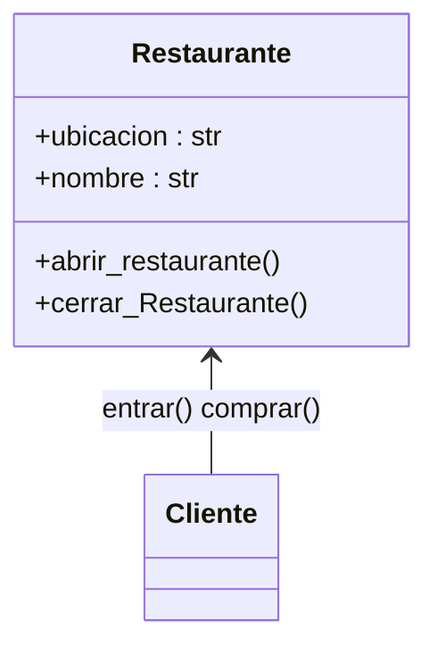
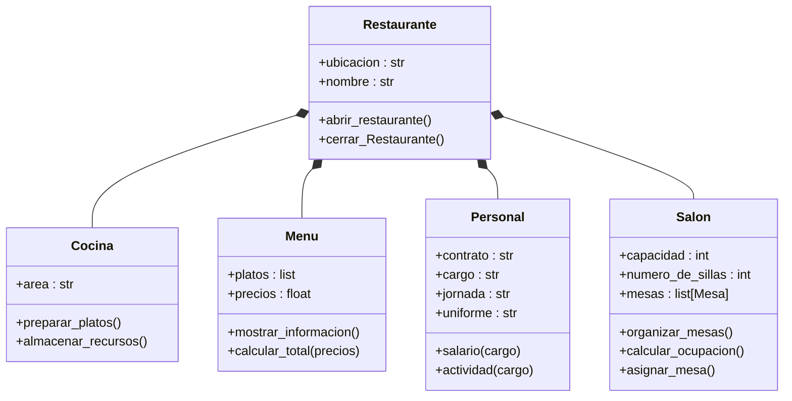
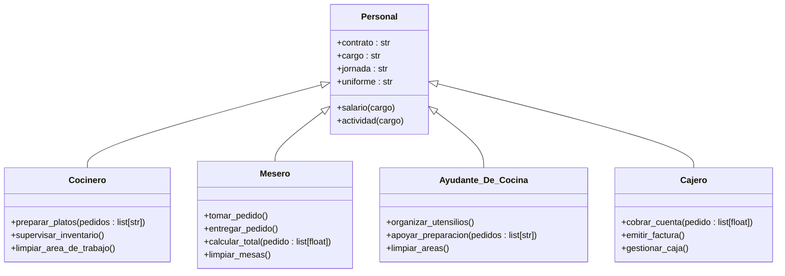
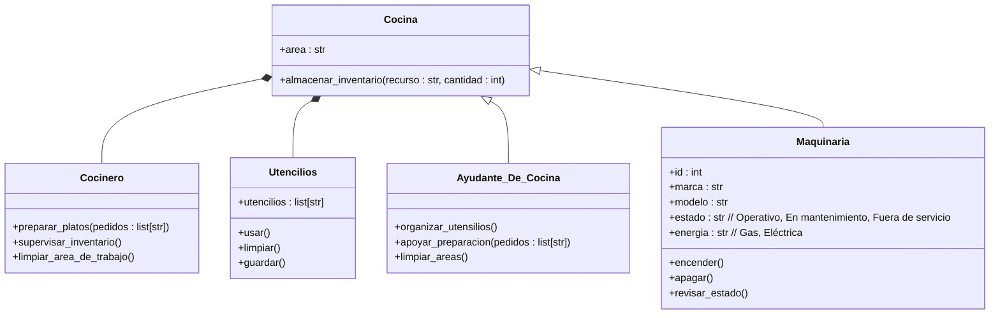
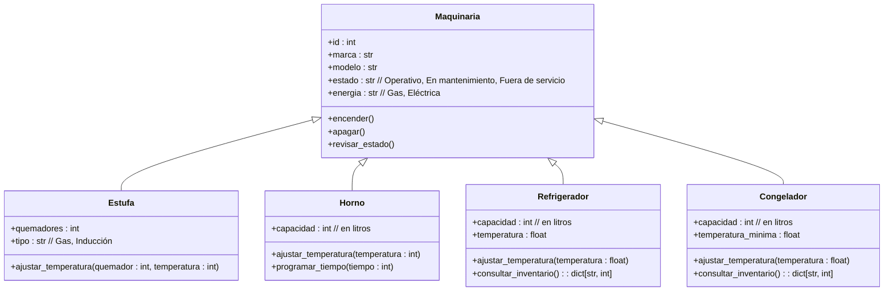
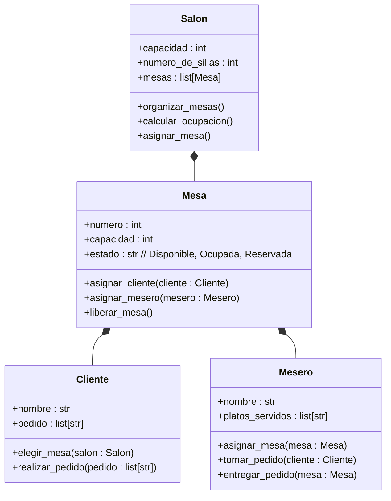

# RETO-2-POO
### Soy Jhon Sebastian Rodriguez Ramirez y pertenezco al grupo de "Parchados".

## Caso de estudio: Restaurante
A partir de este caso, fueron modelados los siguientes diagramas de UML

### Relacion Restaurante - cliente

### Relacion Restaurante - Componentes

### Relacion entre personal

### Relacion Cocina 

### Relacion Maquinaria

### Relacion Salon

###
